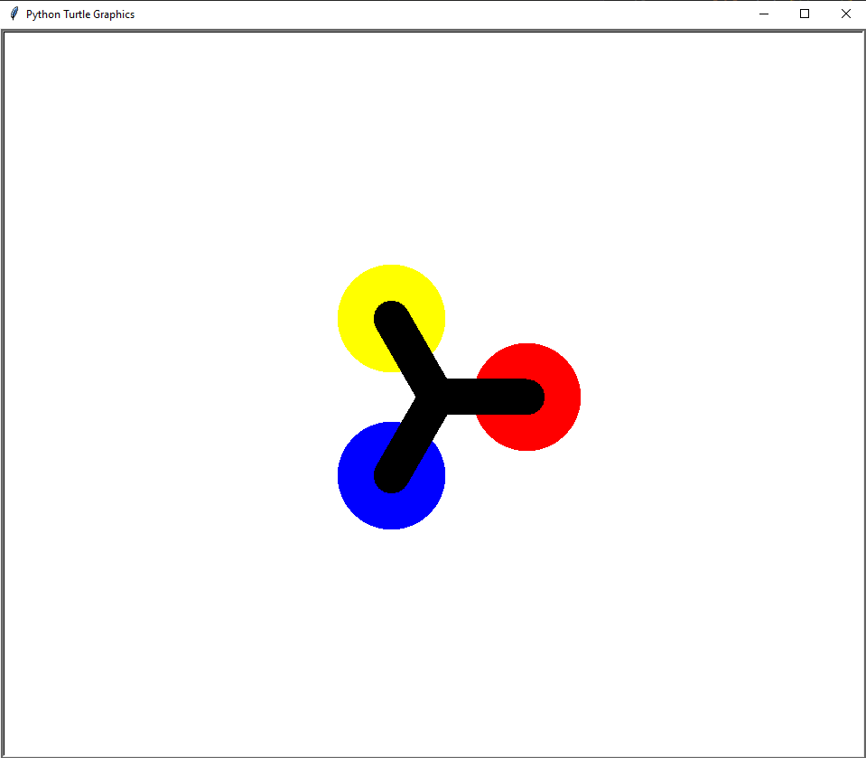

# py-projects-public-repo

Collection of small Python projects I built while learning programming.

## Projects included

### MusicPlayer.py

MP3 player with play/pause/unpause/stop controls.

Setup:
1. Create a folder named `music` in the same directory
2. Add your .mp3 files to the Music folder
3. Run the script

---

### Spinner.py

Rotating wheel animation with keyboard controls.

Features:
- 3 rotating colored dots (red, yellow, blue)
- A key = Spin left
- D key = Spin right  
- Smooth slowdown animation

Setup:
1. Run the script: `python Spinner.py`
2. Press A to spin left
3. Press D to spin right

Technologies: Python, Turtle Graphics

What I learned:
- Animation loops with `ontimer()`
- State management with dictionaries
- Event handling with keyboard input
- Turtle graphics fundamentals

---

### Qrcode.py

Generate QR codes from URLs or text.

Simply run the script and input text to generate a QR code.

---

### DesktopNotifier.py

Task reminder that sends desktop notifications.

---

### ScreenRecorder.py

Record your screen activity.

---

### ScreenShot.py

Simple screenshot capture tool.

---

## What I'm Learning

- Python fundamentals (variables, loops, functions)
- GUI programming (Turtle Graphics, PyQt5)
- Libraries and modules
- Event handling and user input
- Animation and graphics
- File I/O operations

## How to Use

Each project is standalone. Just run the .py file with Python:
```bash
python Spinner.py
python MusicPlayer.py
python Qrcode.py
```

Most require Python 3.8+ and some require additional libraries (check each project).

## Getting Started

1. Clone the repository
2. Navigate to a project
3. Read the setup instructions
4. Run with `python filename.py`

---

*Building projects to learn Python and improve my programming skills.*
